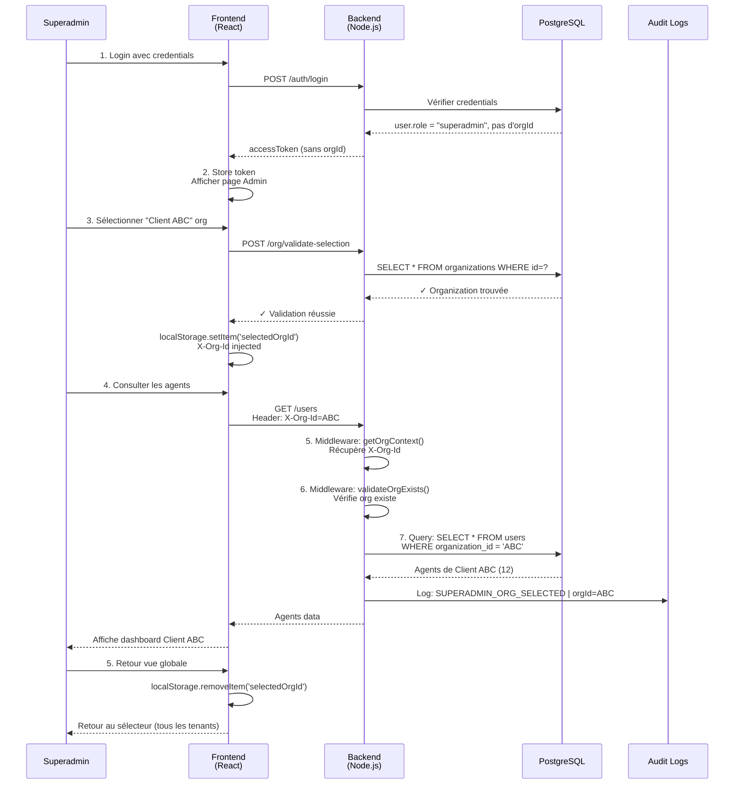
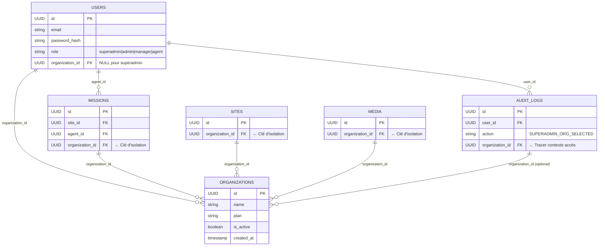
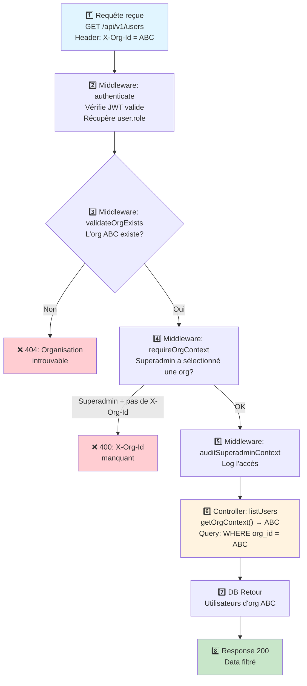
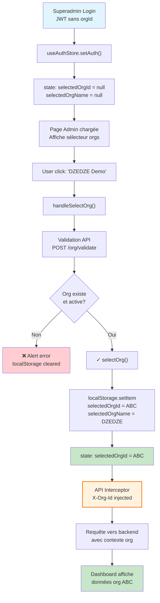
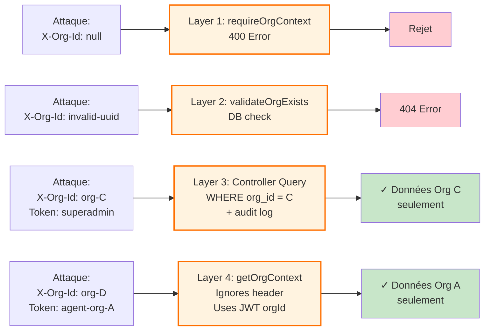
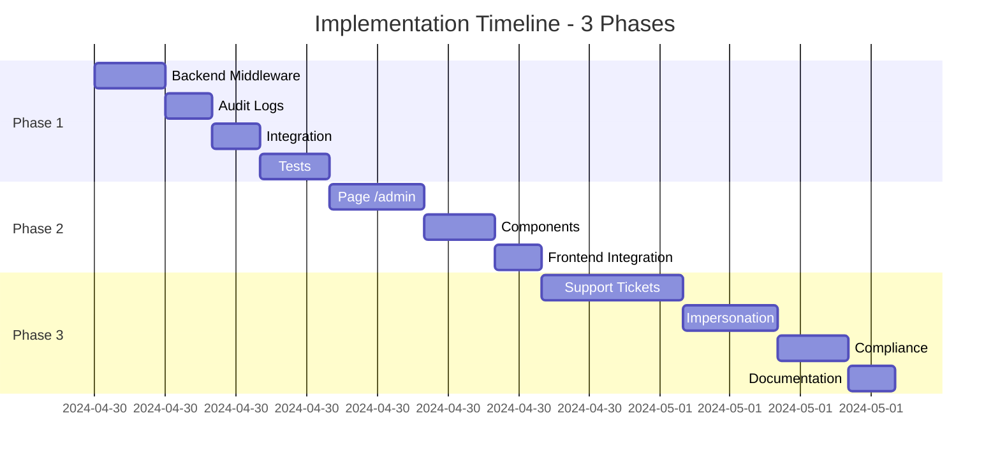
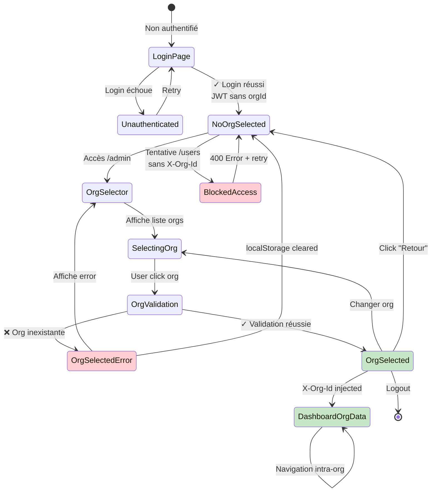
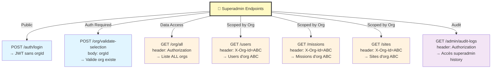

# Diagrammes d'Architecture - Accès Superadmin

## Flux Général: Superadmin Access Flow



---

## Architecture Base de Données



---

## Middleware Chain Request



---

## Isolation Tenant - Garantie SQL

```mermaid
flowchart LR
    A["SELECT * FROM users<br/>WHERE organization_id = X"]
    B["Données Org A:<br/>- Agent 1<br/>- Agent 2"]
    C["Données Org B:<br/>- Agent 3<br/>- Agent 4"]
    D["Base de Données"]
    E["Superadmin accède Org A<br/>X-Org-Id = A"]
    F["Superadmin voit<br/>SEULEMENT Org A"]
    G["Pas d'accès Org B"]

    E --> A
    D --> B
    D --> C
    A --> F
    F --> G
    
    style E fill:#e1f5ff
    style F fill:#c8e6c9
    style G fill:#ffcdd2
    style A fill:#fff3e0,stroke:#ff6f00,stroke-width:2px
    linkStyle 4 stroke:#00b050,stroke-width:3px
    linkStyle 5 stroke:#c00000,stroke-width:3px
```

---

## Frontend: State Management Flow



---

## Security Layers - Defense in Depth



---

## Audit Trail - Superadmin Actions

```mermaid
timeline
    title Superadmin Session Audit Log
    
    14:05:00 : superadmin_1 : SUPERADMIN_NO_ORG : GET /users : 400
    14:05:15 : superadmin_1 : SUPERADMIN_ORG_SELECTED : org_id=ABC : IP=192.168.1.100
    14:05:20 : superadmin_1 : USER_LISTED : org_id=ABC : Consulted 12 agents
    14:06:00 : superadmin_1 : USER_UPDATED : org_id=ABC : Agent reset session
    14:06:05 : superadmin_1 : SUPERADMIN_NO_ORG : localStorage cleared : Retour vue globale
    14:06:10 : superadmin_1 : SUPERADMIN_ORG_SELECTED : org_id=XYZ : IP=192.168.1.100
    14:06:45 : superadmin_1 : SUPERADMIN_NO_ORG : Logout
```

---

## Implementation Phases Timeline



---

## State Diagram: Superadmin Access States



---

## API Endpoints - Superadmin Operations



